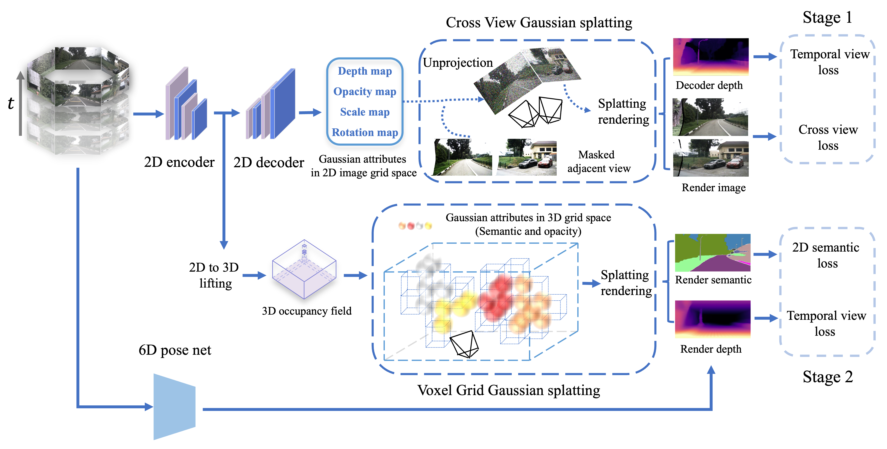

# GaussianOcc (ICCV 2025)

**[Project Page](https://ganwanshui.github.io/GaussianOcc/) | [Arxiv](http://arxiv.org/abs/2408.11447) | [Data](https://github.com/GANWANSHUI/GaussianOcc)**

> GaussianOcc: Fully Self-supervised and Efficient 3D Occupancy Estimation with Gaussian Splatting
> 
> [Wanshui Gan*](https://ganwanshui.github.io/), [Fang Liu*](https://github.com/Fang2896), [Hongbin Xu](https://scholar.google.com.hk/citations?user=mRC_emoAAAAJ&hl=zh-CN), [Ningkai Mo](https://scholar.google.com/citations?user=4cesyTkAAAAJ&hl=en), [Naoto Yokoya](https://naotoyokoya.com/)
> 
> 📖 中文解读（第三方）: [自动驾驶之心](https://zhuanlan.zhihu.com/p/716013147?utm_psn=1810287323511918592)

**Updates:**
- `🔔 2025/06/26` This work has been accepted by ICCV 2025.
- `🔔 2024/11/01` Release the code of generating the 2D semantic map label of DDAD dataset.
- `🔔 2024/08/25` Release the code in stage 2 for both training and evaluation. Code may not be cleaned thoroughly, so feel free to open an issue if any question.
- `🔔 2024/08/22` Paper release and the code will be released next week.

## 🕹 Demos

Demos are a little bit large; please wait a moment to load them.

## 3D Occupancy and Render Depth:

### nuScenes:

<p align='center'>


</p>

### DDAD:

<p align='center'>


<!-- nuScenes -->
</p>

## 📝 Introduction

We introduce GaussianOcc, a systematic method that investigates the two usages of Gaussian splatting for fully self-supervised and efficient 3D occupancy estimation in surround views. First, traditional methods for self-supervised 3D occupancy estimation still require ground truth 6D poses from sensors during training. To address this limitation, we propose Gaussian Splatting for Projection (GSP) module to provide accurate scale information for fully self-supervised training from adjacent view projection. Additionally, existing methods rely on volume rendering for final 3D voxel representation learning using 2D signals (depth maps, semantic maps), which is both time-consuming and less effective. We propose Gaussian Splatting from Voxel space (GSV) to leverage the fast rendering properties of Gaussian splatting. As a result, the proposed GaussianOcc method enables fully self-supervised (no ground truth pose) 3D occupancy estimation in competitive performance with low computational cost (2.7 times faster in training and 5 times faster in rendering).

## 💡 Method

Method Overview:

<p align='center'>

</p>

## 🔧 Installation

Clone this repo and install the dependencies:

```bash
git clone --recurse-submodules https://github.com/GANWANSHUI/GaussianOcc.git
cd GaussianOcc
conda create -n gsocc python=3.8
conda activate gsocc
conda install pytorch==1.9.1 torchvision==0.10.1 cudatoolkit=11.3 -c pytorch -c conda-forge
pip install -r requirements.txt

cd submodule/diff-gaussian-rasterization-confidence
pip install .

cd submodule/diff-gaussian-rasterization-confidence-semantic
pip install .

cd submodule/simple-knn
pip install .
```

Our code is tested with Python 3.8, PyTorch 1.9.1 and CUDA 11.3 and can be adapted to other versions of PyTorch and CUDA with minor modifications.

## 🏗 Dataset Preparation

<details>
<summary> Click for more  </summary>
You can add the softlink if you already had the related dataset, such as:

```bash
ln -s  path_to_nuscenes GaussianOcc/data

ln -s  path_to_ddad GaussianOcc/data
```

### nuScenes

1. Download nuScenes V1.0 full dataset data from [nuScenes](https://www.nuscenes.org/nuscenes#download) and link the data folder to `./data/nuscenes/`.
2. Download the ground truth occupancy labels from [Occ3d](https://tsinghua-mars-lab.github.io/Occ3D/) and unzip the `gts.tar.gz` to `./data/nuscenes/gts`. Note that we only use the 3d occupancy labels for validation.
3. Generate the ground truth depth maps for validation:

   ```bash
   python tools/export_gt_depth_nusc.py
   ```
4. Download the generated 2D semantic labels from [semantic_labels](https://cloud.tsinghua.edu.cn/d/564c9ac19b5f4b54a774/) and extract the data to `./data/nuscenes/`. We recommend that you use `pigz` to speed up the process.
5. Download the pretrained weights of our model from [Google](https://drive.google.com/drive/folders/1ojxpFjj1bG4s5EiteLsqFnAz7liDhgq7) or [百度](https://pan.baidu.com/s/1rUvOZeVGS_2uyeDNISyF9w), the password is `778c`, and move them to `./ckpts/`.
6. (Optional) If you want to generate the 2D semantic labels by yourself, please refer to the `README.md` in [GroundedSAM_OccNeRF](https://github.com/JunchengYan/GroundedSAM_OccNeRF). The  dataset index pickle file `nuscenes_infos_train.pkl` is from [SurroundOcc](https://cloud.tsinghua.edu.cn/d/8dcb547238144d08a0bb/) and should be placed under `./data/nuscenes/`.

### DDAD

* Please download the official [DDAD dataset](https://tri-ml-public.s3.amazonaws.com/github/DDAD/datasets/DDAD.tar) and place them under `data/ddad/raw_data`. You may refer to official [DDAD repository](https://github.com/TRI-ML/DDAD) for more info and instructions.
* Please download [metadata](https://cloud.tsinghua.edu.cn/f/50cb1ea5b1344db8b51c/?dl=1) of DDAD and place these pkl files in `datasets/ddad`.
* We provide annotated self-occlusion masks for each sequences. Please download [masks](https://cloud.tsinghua.edu.cn/f/c654cd272a6a42c885f9/?dl=1) and place them in `data/ddad/mask`.
* Export depth maps for evaluation
* The ddad semantic map generation is similar to nuscenes above. We also provide the generation code of DDAD dataset. Please refer the [GroundedSAM_GaussianOcc](https://github.com/Fang2896/GroundedSAM_GaussianOcc).

```bash
cd tools
python export_gt_depth_ddad.py val
```

The Final folder structure should be like:

```
GaussianOcc/
├── ckpts/
│   ├── ddad-sem-gs/
│   ├── nusc-sem-gs/
│   ├── stage1_pose_nusc/
│   ├── stage1_pose_ddad/
├── data/
│   ├── nuscenes/
│   │   ├── nuscenes/
│   │   │   ├── maps/
│   │   │   ├── samples/
│   │   │   ├── sweeps/
│   │   │   ├── v1.0-trainval/
│   │   ├── gts/
│   │   ├── nuscenes_depth/
│   │   ├── nuscenes_semantic/
│   │   ├── nuscenes_infos_train.pkl
│   ├── ddad/
│   │   │── raw_data/
│   │   │   │── 000000
|   |   |   |── ...
|   |   |── depth/
│   │   │   │── 000000
|   |   |   |── ...
|   |   |── mask/
│   │   │   │── 000000
|   |   |   |── ...
|   |   |── ddad_semantic/
│   │   │   │── 000000
|   |   |   |── ...
```

</details>

## 🚀 Quick Start

### Training and Evaluation

<!-- Train GaussianOcc with semantic supervision: -->

```bash
sh run_gs_occ.sh
```

### Visualization

Visualize the semantic occupancy prediction:

```bash
python tools/export_vis_data.py  # You can modify this file to choose scenes you want to visualize. Otherwise, all validation scenes will be visualized.

sh run_vis.sh

python gen_scene_video.py scene_folder_generated_by_the_above_command --sem_only
```

## 🙏 Acknowledgement

Many thanks to these excellent projects:

- [SimpleOccupancy](https://github.com/GANWANSHUI/SimpleOccupancy)
- [OccNeRF](https://github.com/LinShan-Bin/OccNeRF)
- [SelfOcc](https://github.com/huang-yh/SelfOcc)
- [SparseOcc](https://github.com/MCG-NJU/SparseOcc/tree/main)
- [SurroundDepth](https://github.com/weiyithu/SurroundDepth)

Recent related works:

- [GaussianFormer](https://github.com/huang-yh/GaussianFormer)
- [GaussianBeV](https://arxiv.org/pdf/2407.14108)

## 📃 Bibtex

If you find this repository/work helpful in your research, welcome to cite our papers and give a ⭐.

```
@article{gan2024gaussianocc,
  title={GaussianOcc: Fully Self-supervised and Efficient 3D Occupancy Estimation with Gaussian Splatting},
  author={Gan, Wanshui and Liu, Fang and Xu, Hongbin and Mo, Ningkai and Yokoya, Naoto},
  journal={arXiv preprint arXiv:2408.11447},
  year={2024}
}

@article{gan2024comprehensive,
  title={A Comprehensive Framework for 3D Occupancy Estimation in Autonomous Driving},
  author={Gan, Wanshui and Mo, Ningkai and Xu, Hongbin and Yokoya, Naoto},
  journal={IEEE Transactions on Intelligent Vehicles},
  year={2024},
  publisher={IEEE}
}
```
